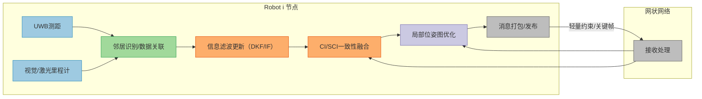
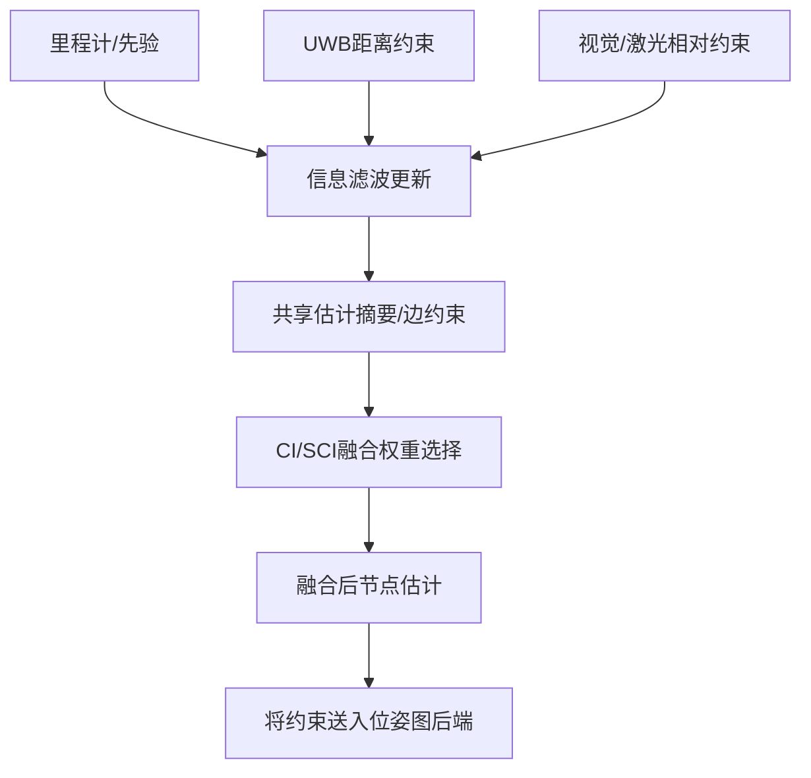
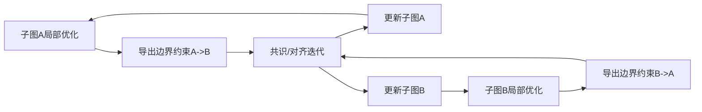
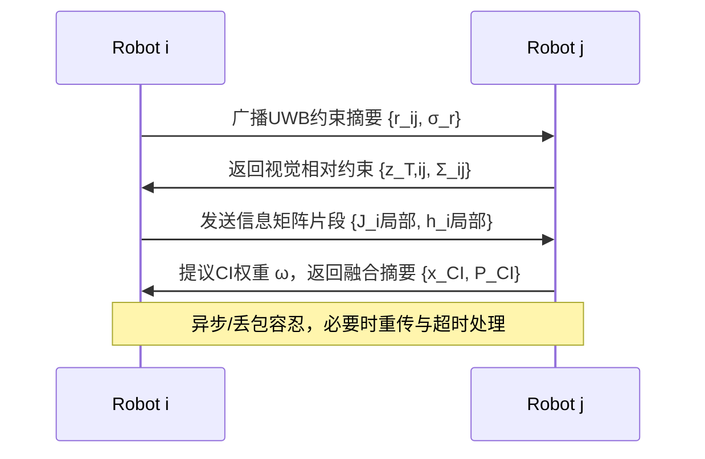

# 无锚分布式协同定位与导航系统：方案设计、算法设计、系统预期效果与图表

课程：1导航技术基础  
作者：________（学号：________）  
日期：2026-01-14

---

## 1. 方案设计

### 1.1 设计目标
- 面向大规模无人机/机器人集群（N≥50），在无GPS或仅少量临时锚点条件下，实现相对坐标系的建立与维持。
- 单体仅依赖邻居的本地相对观测（UWB距离、视觉/激光相对位姿、方位角），通过网状网络进行分布式信息融合。
- 在通信带宽受限与异步拓扑变化条件下，保持定位精度、鲁棒性与收敛速度的平衡。

### 1.2 系统功能与模块
- 传感前端：UWB测距、视觉/激光里程计与跨机器人相对约束（闭环）。
- 数据关联：邻居识别、特征匹配与闭环候选筛选（JPDA/RANSAC/语义过滤）。
- 分布式融合：分布式卡尔曼滤波（信息形式）与CI/SCI一致性融合。
- 分布式后端：分布式因子图/位姿图优化（PGO/FG-Optimization），稳健损失与闭环拒绝。
- 通信与网络：网状网络、轻量消息协议、异步更新与子图合并。
- 坐标系维护：无锚自由度管理（选择参考节点或虚拟锚约束以供比较与评估）。

**图1 系统架构原理图（示意）**  
说明：蓝色=传感前端；绿色=数据关联；橙色=分布式融合；紫色=分布式后端；灰色=通信与网络。输入：UWB距离r_ij（m）、视觉/激光相对约束z_ij（姿态）、里程计x_i^odom；输出：团队相对位姿集合{X}（SE(3)）。


  
表1 系统架构模块说明与输入/输出（对应图1）

| 模块名称           | 主要功能               | 输入（量纲/单位）                 | 输出（量纲/单位）                 | 备注                       |
|--------------------|------------------------|-----------------------------------|-----------------------------------|----------------------------|
| UWB测距           | 采集邻居间距离        | r_ij（m）；σ_r（m）              | 距离约束（m）                    | 可扩展AoA/TDoA            |
| 视觉/激光里程计   | 本机里程计与约束来源  | 位姿增量（m, rad）；特征匹配结果 | 里程计先验（m, rad）；候选相对位姿约束（m, rad） | 视觉/激光可任选            |
| 邻居识别/数据关联 | 邻居检测、闭环候选筛选 | 传感特征/ID；时戳（s）           | 通过的约束集合；质量评分         | 支持JPDA/RANSAC/语义过滤 |
| 信息滤波更新（DKF/IF） | 信息形式更新局部估计   | H、R、约束z（单位随约束）         | J（1/单位²）、h（1/单位）；x_i估计（m, rad） | IF便于摘要共享            |
| CI/SCI一致性融合  | 避免未知相关造成过度乐观 | 本地(x_i,P_i)与邻居(x_j,P_j)    | x_CI（m, rad）；P_CI（m², rad²） | ω∈[0,1]；SCI更不保守     |
| 局部位姿图优化（PGO） | 稳健因子图优化        | 约束z_ij、Σ_ij（m², rad²）       | 优化后x_i（m, rad）；残差统计    | 使用Huber/Cauchy损失      |
| 消息打包/发布      | 轻量化摘要与约束广播  | 关键帧、约束、协方差、信息块      | 消息包（字节B）                  | 降采样/带宽控制            |
| 网状网络接收处理   | 接收与解析邻居消息    | 消息包（B）；时间戳（s）          | 约束入库；融合触发               | 异步/丢包容忍             |

---

## 2. 算法设计

### 2.1 状态与观测模型
- 单体状态：x_i ∈ SE(3)，可扩展速度v_i与偏置b_i（单位：m, rad）。
- UWB距离量测（LOS简化）：z_r,ij = ||p_i - p_j|| + n_r，n_r ~ N(0, σ_r²)，单位：m。
- 视觉/激光相对位姿：z_T,ij = T_i^{-1} T_j ⊕ n_T，旋转（rad）、平移（m）。
- 信息形式更新（线性化）：J_i ← J_i + HᵀR⁻¹H；h_i ← h_i + HᵀR⁻¹z；x_i = J_i^{-1} h_i。

表2 状态/观测/噪声符号与量纲说明
| 符号 | 含义                     | 量纲/单位     | 备注                          |
|------|--------------------------|---------------|-------------------------------|
| x_i  | 节点i位姿（SE(3)）      | m, rad        | 平移/旋转                     |
| r_ij | UWB距离量测             | m             | 节点i到j的距离                |
| z_T,ij | 视觉/激光相对位姿约束 | m, rad        | i到j的相对位姿                |
| J    | 信息矩阵                | 1/(m², rad²)  | 信息形式滤波用                |
| h    | 信息向量                | 1/m, 1/rad    | 信息形式滤波用                |
| Σ_ij | 量测协方差              | m², rad²      | 各约束的噪声水平              |
| ω    | CI融合权重              | 无量纲        | [0,1]区间                     |

### 2.2 分布式卡尔曼滤波与CI/SCI一致性融合
- 动机：跨机器人估计存在未知相关，直接融合会“数据重计”；CI保证一致性（保守但稳定），SCI在不相关子空间更不保守。
- 经典CI：
  - P_CI^{-1} = ω P_a^{-1} + (1-ω) P_b^{-1}
  - x_CI = P_CI [ ω P_a^{-1} x_a + (1-ω) P_b^{-1} x_b ]
  - ω∈[0,1]，可按min trace/det数值搜索或启发式。

**图2 分布式IF+CI/SCI融合流程图（节点级）**  
说明：输入=里程计/约束；输出=融合后估计；“共享摘要”仅含关键帧、约束与统计量以节省带宽。



### 2.3 分布式因子图/位姿图优化（PGO/FG-Optimization）
- 目标：min Σ ρ( || f_ij(X_i,X_j) - z_ij ||_{Σ_ij} )，ρ为稳健损失（Huber/Cauchy）。
- 分布式解法：子图局部优化 + 跨子图共识/对齐（Riemannian/共识ADMM等）。
- 无锚规约：评估/展示时固定参考节点或重心以消解整体自由度。

**图3 分布式PGO迭代流程（跨子图）**  
说明：子图A/B局部优化后交换边界约束，通过共识迭代对齐，再回写更新。



### 2.4 数据关联与闭环鲁棒性
- JPDA/语义过滤提升跨机器人匹配正确率；RANSAC与稳健损失拒绝误闭环。
- 带宽约束：发送“约束摘要”（位姿、残差、协方差），关键帧降采样。

**图4 数据关联���闭环筛选流程**  
说明：从邻居检测到一致性验证与质量评分，仅保留高质量约束进入后端与通信。

```mermaid
flowchart TB
  NeighDet[邻居/候选闭环检测] --> Match[特征匹配/描述子]
  Match --> Validate[几何一致性(RANSAC)]
  Validate --> Score[质量评分(残差/置信)]
  Score --> Select[筛选通过约束]
  Select --> Send[打包约束摘要/发送]
```

---

## 3. 原理图、流程图与消息时序

**图5 节点间消息时序图（通信示意）**  
说明：i、j为邻居；消息含“约束摘要”“信息矩阵片段”“关键帧位姿”；时间轴向右。单位：距离（m），角度（rad），时间（s），消息大小（B）。



**图6 系统总体流程图（从传感到估计发布）**  
说明：输入=UWB/视觉/激光；输出=团队相对位姿供编队/导航。单位：位置（m），角度（rad）。

```mermaid
flowchart LR
  Sense[传感采集(UWB/视觉/激光)] --> Assoc[关联与闭环筛选]
  Assoc --> IFU[信息滤波更新]
  IFU --> CIFuse[CI 和 SCI 一致性融合]
  CIFuse --> PGO[分布式位姿图优化]
  PGO --> Pub[发布团队相对位姿估计]
  Pub --> Control[下游编队或导航控制]
```

---

## 4. 系统预期效果

### 4.1 性能目标与指标
- 相对定位精度：LOS为主的典型场景达到厘米级–分米级RMSE（依赖传感/环境）。
- 收敛与稳定：数十节点网络在秒级–十秒级窗口内形成稳定相对坐标系。
- 通信效率：单约束消息≤数百字节；关键帧与约束按需下采样。
- 鲁棒性：误闭环被筛选/稳健损失抑制；异步/丢包下误差有界。

表3 评价指标与单位
| 指标                 | 定义/度量                                    | 单位 |
|----------------------|----------------------------------------------|------|
| ATE（相对轨迹误差）  | 相对对齐后轨迹的绝对误差均值/RMSE            | m    |
| RPE（相对位姿误差）  | 邻近帧增量位姿的误差统计                      | m, rad |
| 收敛时间             | 达到稳态误差门限的时间                        | s    |
| 带宽占用             | 单位时间传输字节数/消息数                     | B/s, msg/s |
| 闭环精确率/召回率    | 正确闭环比例/召回比例                         | %    |

**图7 性能曲线示意图（误差-时间）**  
说明：横轴时间t（s）；纵轴相对位姿RMSE（m）。示意不同融合策略（DKF、CI、CI+PGO）的收敛与稳态误差对比。

```
RMSE (m)
1.0 |\
    | \__ DKF
0.5 |   \_____ CI
    |          \____ CI+PGO
0.1 |
    +-------------------------
        0   5   10   15   t (s)
```

---

## 5. 通信消息与字段

表4 消息字段设计与单位
| 字段名          | 类型/单位        | 说明                                 |
|-----------------|------------------|--------------------------------------|
| sender_id       | 整数             | 发送者节点ID                          |
| keyframe_id     | 整数             | 关键帧索引                            |
| pose            | [m, rad]         | 关键帧位姿（位置+姿态）               |
| constraint_type | 枚举             | UWB/视觉/激光/里程计                  |
| residual        | [m, rad]         | 约束残差                              |
| covariance      | [m², rad²]       | 协方差（对角/块对角）                  |
| info_block      | 矩阵（1/单位²）  | 信息矩阵摘要（可选）                   |
| timestamp       | s                | 时间戳                                |

---

## 6. 节点级伪代码（实现参考）

**图8 节点级融合与优化伪代码**  
说明：输入=UWB/视觉/激光约束与里程计；输出=节点估计与局部图Gi。单位见表2。

```pseudo
Inputs:
  - UWB ranges r_ij (m), visual/LiDAR constraints z_T,ij (m, rad)
  - Odometry x_i^odom
Outputs:
  - Node i estimate x_i (m, rad), local graph Gi

Procedure NodePipeline(i):
  // 前端更新（信息形式）
  (J_i, h_i) <- InfoFilterUpdate(x_i^odom, r_ij, z_T,ij)
  // 共享摘要（轻量）
  Msg_i <- PackSummary(keyframes, constraints, covariances, info_blocks?)
  Broadcast(Msg_i)
  // 接收邻居消息
  for Msg_j in Inbox:
    (x_j, P_j) <- ExtractEstimate(Msg_j)
    // CI/SCI一致性融合
    ω <- SelectWeight(J_i, P_j) // min trace/det heuristic
    (x_CI, P_CI) <- CI_Fuse((x_i,P_i),(x_j,P_j), ω)
    UpdateLocalEstimate(x_CI, P_CI)
    // 后端PGO：加入约束并局部优化
    Gi <- AddConstraints(Gi, Msg_j.constraints)
    x_i <- LocalPGO(Gi, robust_loss = Huber)
  end for
  Publish(x_i)
end
```

---

## 7. 作图与排版规范（确保“自明性”）
- 图名/图号置于图下方，格式“图n 标题（单位/说明）”；必要说明横排于图名下。
- 颜色图例统一：传感=蓝、关联=绿、���合=橙、后端=紫、通信=灰；图中放置图例。
- 曲线图必须标注坐标量纲（t：s；误差：m；角度：rad）；无量纲时方可省略。
- 表格需“自明性”：表名/表号、单位/量纲/符号说明完整；按“左至右横排、数据依序竖排”编排。
- Visio建议：使用“基本流程图/网络图”模板；统一字体（微软雅黑/10pt），网格对齐；导出PNG/SVG（≥300 dpi）。

---

（渲染提示：将本文件以 .md 扩展名放入 GitHub 仓库后，网页端可直接渲染表格与 Mermaid 图。若在本地预览，推荐 Typora/Obsidian 或 VS Code + Mermaid 预览扩展。）
